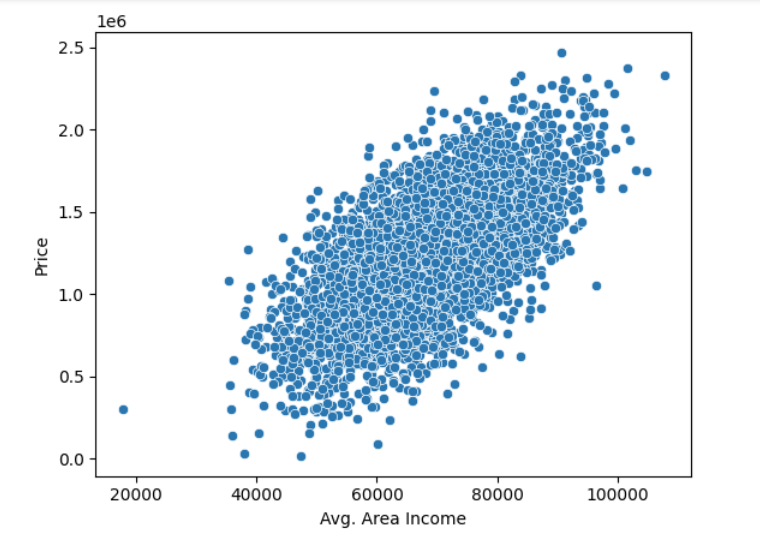
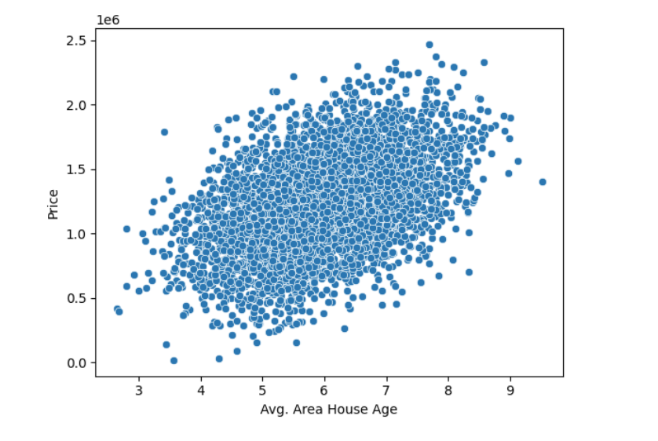
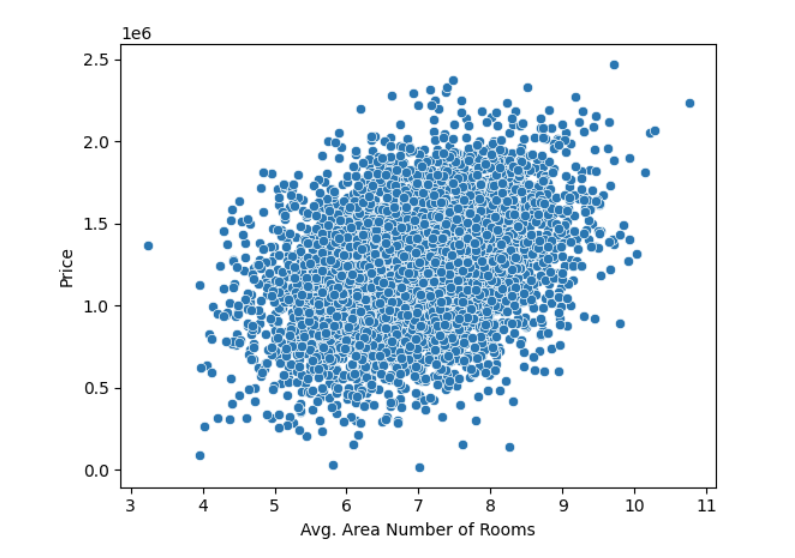
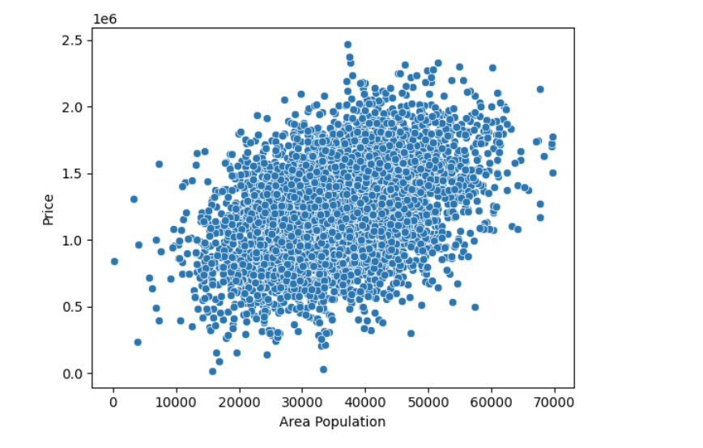

# Linear Regression Analysis

## Description
 In this code, I carried exploratory data analysis based on housing data. 

## Table of Contents
- [Linear Regression Analysis](#linear-regression-analysis)
  - [Description](#description)
  - [Table of Contents](#table-of-contents)
  - [Installation](#installation)
  - [Usage](#usage)
  - [License](#license)
  - [Contributing](#contributing)
  - [Credits](#credits)
  - [Tests](#tests)
  - [Questions](#questions)

## Installation
python & python libraries

## Usage

Price versus area income:

Price versus average area house age:

A screenshot of the price versus average area number of rooms:

The repository can be accessed using this link:https://github.com/Mikemupararano/linear_regression_analysis/tree/main.

## License
This application is covered under the MIT license.

## Contributing
 N/A

## Credits
N/A
## Tests
N/A

## Questions
For any questions or concerns, please contact me at [kudath@yahoo.co.uk](mailto:kudath@yahoo.co.uk).
You can also find me on GitHub: [https://github.com/Mikemupararano](https://github.com/https://github.com/Mikemupararano)
